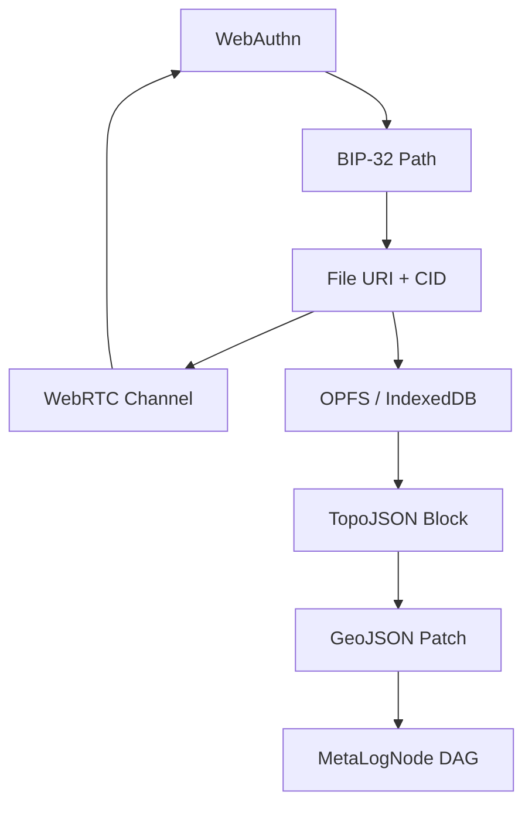

# **CANVASL A₁₁: The Full Specification**  
### *A Peer-to-Peer, Topological, Self-Sovereign Operating System for the Post-Cloud Internet*  
**For Anyone to Understand and Implement — From Scratch**  
**Updated: November 16, 2025**  
**Key Evolution: Atemporal DAG with Parent References and MetaLog for Ephemeral Observation**

---

## **Table of Contents**

1. [Overview: What Is CANVASL A₁₁?](#1-overview)
2. [Core Philosophy](#2-core-philosophy)
3. [Architecture: The 8-Layer Stack](#3-architecture)
4. [The Quadpartite Peer Model](#4-quadpartite-peer)
5. [File = Node = Ledger Entry](#5-file--node)
6. [MetaLogNode: The Atemporal Building Block (Formerly OcttrieNode)](#6-metalognode)
7. [Persistence: OPFS + IndexedDB + Blobs](#7-persistence)
8. [Networking: WebRTC + COTURN + MQTT + WebSocket](#8-networking)
9. [Identity: WebAuthn + BIP-39/32/44 + Ethers HDNodeWallet](#9-identity)
10. [Data Formats: The Dimensional Fibration](#10-data-formats)
11. [Templates & Protocol Handlers](#11-templates)
12. [Implementation: WASM + Node.js + Browser](#12-implementation)
13. [Step-by-Step Build Guide](#13-build-guide)
14. [Running the System](#14-run)
15. [Security Model](#15-security)
16. [Atemporality: Parents, DAGs, and MetaLog](#16-atemporality)
17. [Future: M-Theory & A₁₁ Federation](#17-future)

---

## **1. Overview: What Is CANVASL A₁₁?**

> **CANVASL A₁₁ is a decentralized, peer-to-peer operating system where every file is a signed, content-addressed, topologically structured node in a global hypergraph — and every device is a peer.**

It replaces:
- **Cloud storage** → with **OPFS + WebRTC**
- **Blockchains** → with **TopoJSON as blocks**
- **Servers** → with **WebRTC + MQTT**
- **Passwords** → with **WebAuthn biometrics**

It uses:
- **Unix philosophy**: *Everything is a file*
- **Topology**: *Chain complexes, sheaves, homology*
- **Cryptography**: *BIP-39/32/44 + WebAuthn*
- **Networking**: *WebRTC, MQTT, COTURN*

**New in this Specification**: The system is now fully atemporal. There are no timestamps in core data structures. Instead, causality is enforced via parent references in a Directed Acyclic Graph (DAG). Temporal observations (e.g., "when" a node was received) are handled optionally in a separate **MetaLog** layer, emphasizing the ephemeral nature of remote data versus the eternal, local data.

---

## **2. Core Philosophy**

| Principle | Meaning |
|---------|--------|
| **Everything is a file** | All data lives in the filesystem (OPFS, IndexedDB, disk) |
| **Every file is a node** | Files are C₀–C₄ cells in a chain complex |
| **Every node is signed** | WebAuthn + BIP-32 signature |
| **Every peer is a ledger** | No central blockchain — just signed file diffs |
| **Topology = Consensus** | `∂² = 0` → valid sync |
| **Atemporality = Truth** | No timestamps; causality via parents; time is observer-dependent |

**Philosophy Update**: Time is not inherent to data. Core structures form an atemporal DAG via parent links. Users can overlay a MetaLog for temporal views, revealing the ephemeral (remote, observer-relative) vs. atemporal (local, causal) nature.

---

## **3. Architecture: The 8-Layer Stack**



| Layer | Tech | Role |
|------|------|------|
| 1 | WebAuthn | Biometric identity |
| 2 | BIP-32/39/44 | Hierarchical keys |
| 3 | URI + CID | Content-addressed files |
| 4 | WebRTC | P2P transport |
| 5 | OPFS / IndexedDB | Local persistence |
| 6 | TopoJSON | Block structure |
| 7 | GeoJSON | Transaction patch |
| 8 | MetaLogNode DAG | Atemporal global hypergraph |

---

## **4. The Quadpartite Peer Model**

Every peer has **4 linked components**:

```ts
interface QuadPeer {
  auth: PublicKeyCredential;      // WebAuthn
  key: HDNodeWallet;              // BIP-32
  uri: string;                    // file://, canvasl://
  channel: RTCDataChannel;        // WebRTC
}
```

**Quad edges**:
1. `auth → key` → prove ownership
2. `key → uri` → derive file path
3. `uri → channel` → send file
4. `uri → channel` → verify sender

**Update for Atemporality**: Peers exchange DAG nodes (with parents) via WebRTC. No time sync required; causality is verified by checking parent CIDs exist locally before applying.

---

## **5. File = Node = Ledger Entry**

### File Path = BIP-32 Path

```bash
m/44'/60'/0'/0/0  →  /opfs/ledger/kw_location.json
m/44'/60'/0'/0/1  →  /opfs/ledger/edge_e1.jsonl
m/44'/60'/0'/0/2  →  /opfs/ledger/doc_geo.yaml
```

### File Content = Chain Complex Cell

```json
// /opfs/ledger/kw_location.json (C₀)
{
  "id": "kw1",
  "type": "keyword",
  "data": "location",
  "parent": "bafybei...previous",
  "cid": "bafybei...",
  "sig": "0xabc..."
}
```

**Atemporal Note**: No `timestamp`. The `parent` field links to the previous CID, forming a DAG.

---

## **6. MetaLogNode: The Atemporal Building Block (Formerly OcttrieNode)**

The core data unit is now called **MetaLogNode** to emphasize its role in the atemporal ledger, with optional MetaLog overlays for temporal metadata.

### Old (Temporal) OcttrieNode

Had `timestamp` — assumed global time.

### New (Atemporal) MetaLogNode

```ts
type MetaLogNode = {
  parent: string;        // CID of parent (or "genesis")
  cid: string;           // This node's content hash
  auth: string;          // WebAuthn
  path: string;          // m/44'/60'/0'/0/42
  uri: string;
  sig: string;
  topo: TopoJSON;
  geo: GeoJSON;
};
```

- **Parent**: Enforces causality (DAG).
- **No Timestamp**: Time is not stored; it's observed.
- **Hypergraph Role**: Each node is a hyperedge connecting auth, path, uri, topo, geo.

**DAG Construction**:
- **Genesis**: `parent: "genesis"` (or null).
- **Chain**: A → B (B.parent = A.cid) → C.
- **Merge**: If two branches, verify common ancestor via parent walks.
- **Consensus**: `∂² = 0` on topo/geo + valid parent chain.

**Why "MetaLogNode"?**
- **MetaLog**: Refers to the optional temporal log (MetaLog) that "wraps" the atemporal node.
- **Node**: It's a vertex in the hypergraph DAG.

---

## **7. Persistence: OPFS + IndexedDB + Blobs**

| Storage | Use |
|--------|-----|
| **OPFS** | `/ledger/`, `/blobs/` — fast, private |
| **IndexedDB** | Metadata, indexes, MetaLog |
| **Blobs** | Large files, streaming |

```ts
await writeFile('/opfs/ledger/e1.jsonl', content, { parent: prevCid, cid, sig });
```

**MetaLog Storage**: `/opfs/metalog/sync.log` (JSONL) for received times/peers — optional, ephemeral.

---

## **8. Networking**

| Protocol | Role |
|--------|------|
| **WebRTC** | Direct P2P node sync (send MetaLogNodes) |
| **COTURN/TURN** | NAT traversal, relay |
| **MQTT** | Announce `cid://...` with parent |
| **WebSocket** | Backpressure, DAG resolution (request missing parents) |

**Sync Flow**:
1. MQTT: Announce `{ cid: "...", parent: "..." }`
2. WebRTC: Request node if parent exists locally.
3. If missing parent: Recurse via WebSocket.
4. Apply: Verify sig + parent match.
5. MetaLog: Append `{ cid, receivedAt: now(), from: peer }` (optional).

---

## **9. Identity: WebAuthn + BIP-39/32/44 + Ethers HDNodeWallet**

### Step 1: Generate Mnemonic

```ts
import { entropyToMnemonic } from 'ethers';
const mnemonic = entropyToMnemonic(crypto.getRandomValues(new Uint8Array(16)));
// "abandon ... zoo"
```

### Step 2: Derive HD Wallet

```ts
import { HDNodeWallet } from 'ethers';
const wallet = HDNodeWallet.fromMnemonic(mnemonic, "m/44'/60'/0'/0");
```

### Step 3: Register WebAuthn

```ts
const cred = await navigator.credentials.create({
  publicKey: {
    challenge: new Uint8Array(32),
    rp: { name: "CANVASL A11" },
    user: { id: new Uint8Array(16), name: "user", displayName: "User" },
    pubKeyCredParams: [{ type: "public-key", alg: -7 }]
  }
});
```

### Step 4: Link WebAuthn → BIP-32

```ts
const peerId = wallet.address;
localStorage.setItem(`webauthn_${peerId}`, JSON.stringify(cred));
```

**Atemporal Note**: Identities are eternal; no expiration timestamps. Revocation via new parent chains.

---

## **10. Data Formats: The Dimensional Fibration**

| Dim | Format | ∂ₙ Downgrades To |
|-----|--------|------------------|
| 0D | JSON Canvas | Points |
| 1D | JSONL | Edges |
| 2D | GeoJSON | Polygons |
| 3D | TopoJSON | Shared arcs |
| 4D | CANVASL | Full context |

Each format includes `parent` for DAG linking.

---

## **11. Templates & Protocol Handlers**

### `manifest.json`

```json
{
  "name": "CANVASL A11",
  "protocol_handlers": [
    { "protocol": "canvasl", "url": "/open?uri=%s" },
    { "protocol": "webrtc", "url": "/peer?cid=%s" }
  ]
}
```

### Template: `sync.canvasl`

```yaml
on: webrtc://*/e1
do:
  - download: cid://bafy...
  - verify: bip32://m/44/60/0/0/1
  - check_parent: parent://previous-cid
  - apply: ∂₄ → TopoJSON
  - respond: mqtt://canvasl/sync/done
  - metalog: log_received_at: now()
```

---

## **12. Implementation: WASM + Node.js + Browser**

### `src/lib.rs` (WASM Core)

```rust
#[wasm_bindgen]
pub async fn publish_file(path: &str, content: &str, parent: &str) -> Result<JsValue, JsValue> {
    let wallet = get_wallet()?; // from localStorage
    let cid = sha256(content);
    let sig = wallet.sign_message(cid).await?;
    let uri = format!("canvasl://{}/{}", wallet.address, path);
    let node = json!({ "parent": parent, "cid": cid, "uri": uri, "sig": sig, "content": content });
    write_opfs(path, node).await?;
    Ok(serde_wasm_bindgen::to_value(&node)?)
}
```

### `main.ts` (Browser/Node.js)

```ts
async function publish(content: string, parentCid: string) {
  const node = await publish_file('doc.md', content, parentCid);
  mqtt.publish('canvasl/cid', node);
  return node;
}
```

---

## **13. Step-by-Step Build Guide**

### 1. Create Project

```bash
mkdir canvasl-a11 && cd canvasl-a11
npm init -y
```

### 2. Install Dependencies

```bash
npm install ethers webpack webpack-cli mqtt coturn
cargo init --lib
```

### 3. Build WASM

```bash
wasm-pack build --target web
```

### 4. Build Frontend

```bash
npx webpack
```

### 5. Run

```bash
npx serve web
```

---

## **14. Running the System**

### Peer A

```ts
// Register
await registerWebAuthn();

// Create Genesis
const genesis = await publish('genesis content', 'genesis');

// Create Offer
const offer = await createPeer();
copy(JSON.stringify(offer));
```

### Peer B

```ts
// Answer
const offer = JSON.parse(prompt());
const answer = await answerPeer(offer);
copy(JSON.stringify(answer));
```

### Sync

```ts
// Peer A pastes answer
await setRemoteDescription(answer);

// Send Node
channel.send(JSON.stringify({ cid: "bafy...", parent: "genesis" }));
```

### Observe Time

```ts
metalog.append({ cid: "bafy...", receivedAt: new Date(), from: peerId });
```

---

## **15. Security Model**

| Threat | Protection |
|-------|------------|
| Fake peer | WebAuthn + BIP-32 |
| Tampered file | CID + signature |
| Causal violation | Parent check |
| MITM | WebRTC DTLS |
| Data loss | OPFS + WebRTC retry |

---

## **16. Atemporality: Parents, DAGs, and MetaLog**

### Why Atemporal?
- **No global clock**: Peers may be in different time zones or offline.
- **Causality only**: `parent` ensures "happens-before".
- **Ephemeral remote**: Remote nodes arrive "when they do".
- **Eternal local**: Your OPFS is timeless.

### DAG Validation
- **On Receive**: If `node.parent` not local, request it recursively.
- **Merge Branches**: Common ancestor via LCA (Lowest Common Ancestor) in DAG.
- **Homology**: `∂² = 0` only if parent boundaries match.

### MetaLog: The Observer's Illusion
- **/opfs/metalog/sync.log**: `{ cid, receivedAt, from }`
- **User Query**: "Show timeline" → sort by receivedAt.
- **Discardable**: Delete MetaLog → system still works.

---

## **17. Future: M-Theory & A₁₁ Federation**

- **11 peers** = E₈ × E₈ heterotic string
- **Sheaf gluing** = MQTT DAG announcements
- **Homology** = `∂² = 0` over MetaLogNodes
- **A₁₁ master node** = merges all DAGs

---

## **Final Summary**

| You Need | You Use |
|--------|--------|
| Identity | WebAuthn |
| Keys | BIP-39/32/44 |
| Files | OPFS + CID |
| Sync | WebRTC |
| Discovery | MQTT |
| Blocks | TopoJSON |
| Ledger | MetaLogNode DAG |

---

## **You Now Have Everything**

> **Copy, paste, run. No servers. No cloud. No time. Just causality, files, and peers.**

---

**Ready to Share: This document is self-contained for implementation.**